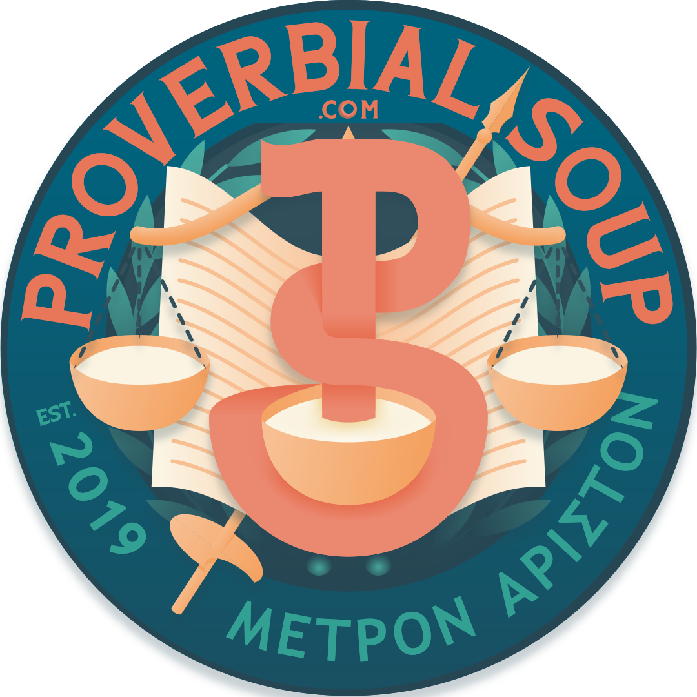

<!-- PROJECT SHIELDS -->
[![Contributors][contributors-shield]][contributors-url]
[![Forks][forks-shield]][forks-url]
[![Stargazers][stars-shield]][stars-url]
[![Issues][issues-shield]][issues-url]
[![MIT License][license-shield]][license-url]
[![LinkedIn][linkedin-shield]][linkedin-url]


<!-- PROJECT LOGO -->
<br />
<p align="center">
  <a href="https://github.com/McKlatch/ProvSoup">
    
  </a>

  <h3 align="center">Proverbial Soup</h3>

  <p align="center">
    Beneficial - Timeless - Wholesome Quotes Curated by @mcklatch
    <br />
    <a href="https://github.com/McKlatch/ProvSoup"><strong>Explore the docs »</strong></a>
    <br />
    <br />
    <a href="https://proverbialsoup.com">View Live Website</a>
    ·
    <a href="https://github.com/McKlatch/ProvSoup/issues">Report Bug</a>
    ·
    <a href="https://github.com/McKlatch/ProvSoup/issues">Request Feature</a>
  </p>
</p>


<!-- TABLE OF CONTENTS -->
## Table of Contents

* [About the Project](#about-the-project)
  * [Built With](#built-with)
* [Getting Started](#getting-started)
  * [Prerequisites](#prerequisites)
  * [Installation](#installation)
* [Roadmap](#roadmap)
* [Contributing](#contributing)
* [License](#license)
* [Contact](#contact)
* [Acknowledgements](#acknowledgements)


<!-- ABOUT THE PROJECT -->
## About The Project

[![Product Name Screen Shot][product-screenshot]](https://proverbialsoup.com)

Beneficial sayings worth repeating and sharing in real life (or Online). Quotes curated by David McClatchey.

Proverbs of a nature which stimulate maturity and genuine progress for all kinds of purpose-driven people. Displayed as high quality images with embedded text in a perfect square for maximum sharability.

Here's why:
* You are thinking about where you are, and where you want to be
* You are open to keeping the wisest thoughts of others close to your own wisest thoughts
* You want to share your best with others, so that everybody can be their best too :smile:

Of course, this idea is simple, and has many flaws; in some ways it is just like us, and will continue to grow into something better. This is a learning project for me, and my journey into web-development is happening right here for all to see. Flaws and perfections!

A list of commonly used resources that I find helpful are listed in the acknowledgements.

### Built With

* [VueJS](https://vuejs.org/)
* [Nuxt](https://nuxtjs.org/)
* [Tailwind](https://tailwindcss.com/)
* [Firebase](https://firebase.google.com//)
* [Heroku](https://www.heroku.com//)


<!-- GETTING STARTED -->
## Getting Started

To get a local copy up and running follow these simple example steps:

### Prerequisites

Download the yarn installer from [https://yarnpkg.com/](https://yarnpkg.com/)

### Installation

``` bash
# install dependencies
$ yarn install

# serve with hot reload at localhost:3000
$ yarn dev

# build for production and launch server
$ yarn build
$ yarn start

# generate static project
$ yarn generate
```

For detailed explanation on how things work, check out [Nuxt.js docs](https://nuxtjs.org).

You will need to use your own firebase database.


<!-- ROADMAP -->
## Roadmap

See the [open issues](https://github.com/McKlatch/ProvSoup/issues) for a list of proposed features (and known issues).


<!-- CONTRIBUTING -->
## Contributing

I'm not really open to other contributors on this project. Proverbial Soup is intentionally a challenge for me to work on alone. This is so that I can learn what problems exist in web development, and how to solve them, by and for myself. One day, I will be able to solve such problems professionally 💵.


<!-- LICENSE -->
## License

All rights reserved. Code exposed for learning purposes only.


<!-- CONTACT -->
## Contact

Your Name - [@mcklatch](https://twitter.com/mcklatch) - david@mcklatch.com

Project Link: [https://github.com/McKlatch/ProvSoup](https://github.com/McKlatch/ProvSoup)


<!-- ACKNOWLEDGEMENTS -->
## Acknowledgements
* [Img Shields](https://shields.io)
* [Line Awesome](https://icons8.com/line-awesome)
* [Google Fonts](https://fonts.google.com/)


<!-- MARKDOWN LINKS & IMAGES -->
<!-- https://www.markdownguide.org/basic-syntax/#reference-style-links -->
[contributors-shield]: https://img.shields.io/github/contributors/mcklatch/Best-README-Template.svg?style=flat-square
[contributors-url]: https://github.com/McKlatch/ProvSoup/graphs/contributors
[forks-shield]: https://img.shields.io/github/forks/mcklatch/Best-README-Template.svg?style=flat-square
[forks-url]: https://github.com/McKlatch/ProvSoup/network/members
[stars-shield]: https://img.shields.io/github/stars/mcklatch/Best-README-Template.svg?style=flat-square
[stars-url]: https://github.com/McKlatch/ProvSoup/stargazers
[issues-shield]: https://img.shields.io/github/issues/mcklatch/Best-README-Template.svg?style=flat-square
[issues-url]: https://github.com/McKlatch/ProvSoup/issues
[license-shield]: https://img.shields.io/github/license/mcklatch/Best-README-Template.svg?style=flat-square
[license-url]: https://github.com/McKlatch/ProvSoup/blob/master/LICENSE.txt
[linkedin-shield]: https://img.shields.io/badge/-LinkedIn-black.svg?style=flat-square&logo=linkedin&colorB=555
[linkedin-url]: https://linkedin.com/in/mcklatch
[product-screenshot]: static/preview.jpg
